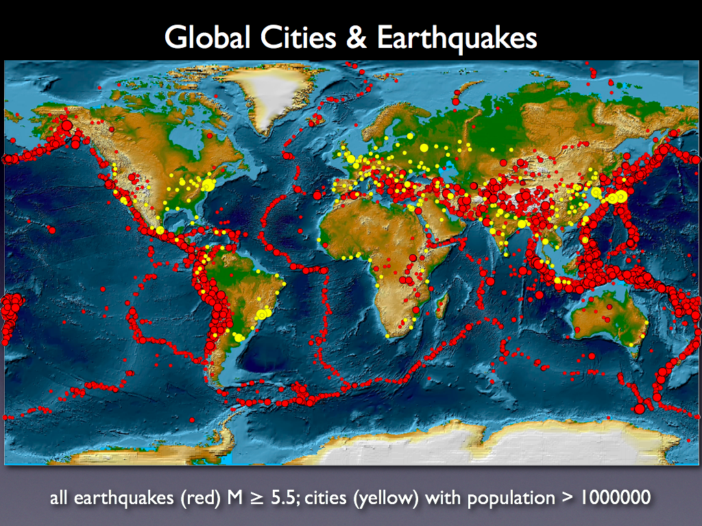

<div align="center">

</div>


<p dir="LTR">
importing packages:
</p>

```{r setup, include=FALSE} 
knitr::opts_chunk$set(warning = FALSE, message = FALSE) 
```


```{r, eval=FALSE}
library(readr)
library(dplyr)
library(plotly)
library(zoo)
library(ggplot2)
library(gganimate)
library(ggthemes)
library(ggmap)
library(animation)
library(highcharter)
library(stringr)
library(PerformanceAnalytics)
library(maps)
library(ggpubr)
library(tidyr)

```

```{r include=FALSE, cache=FALSE}
library(readr)
library(dplyr)
library(plotly)
library(zoo)
library(ggplot2)
library(gganimate)
library(ggthemes)
library(ggmap)
library(animation)
library(highcharter)
library(stringr)
#library(PerformanceAnalytics)
library(maps)
library(tidyr)
library(tidytext)
library(wordcloud2)
library(ngram)
library(qdapRegex)
#library(ggpubr)
```
***

```{r, warning=FALSE}
#historical_data = read_rds("../data/historical_web_data_26112015.rds")
iran_earthquake = read_rds("../data/iran_earthquake.rds")
#disasters = read_delim("../data/signif.txt", delim = "\t")
worldwide = read_csv("../data/worldwide.csv")
Southern_Cal = read_csv("../data/earth007.csv")
# italy = scan(file = "C:/Users/HP/Desktop/listfiles.txt", what = character(), sep = "\n")

```

***

<h5 dir="LTR">
Probability of having an earthquake with
an intensity above 6 Richter:
</h5>

<h5 dir="LTR">
Iran Dataset:
</h5>

```{r, warning=FALSE}
iran_earthquake %>%
  filter(!is.na(Mag))->tmp

fill <- "#4271AE"
line <- "#1F3552"

ggplot(tmp, aes(x = Mag)) +
        geom_density(size=1) + xlab("Magnitude") + ylab("Density") + theme_bw()+ theme(axis.text=element_text(size=14),
        axis.title=element_text(size=14))
```

```{r, warning=FALSE, dpi=300}
qqnorm(tmp$Mag)

a = sample(tmp$Mag, 5000)
shapiro.test(a)
```
```{r, warning=FALSE}
iran_earthquake %>%
  filter(format(as.Date(OriginTime, format="%Y-%m-%d %H:%M:%S"),"%Y")>=2010) %>% filter(Mag>=2) -> iran
```

```{r, warning=FALSE}
duration = difftime(max(iran$OriginTime, na.rm = T),
                    min(iran$OriginTime, na.rm = T),
                    units = "week")
duration = as.numeric(duration)/52.25
duration
```

```{r, warning=FALSE, dpi=300}
iran %>%
  group_by(Mag) %>%
  summarise(n=n()) %>%
  na.omit() %>%
  arrange(-Mag) %>%
  mutate(N=cumsum(n)/duration, logN=log10(N)) %>%
  filter(Mag<=12)-> tmp

ggplot(tmp, aes(x=Mag, y=N))+
  geom_point() +
  xlab("Magnitude") + 
  ylab("Number of Occurance per Year")+
  theme_bw()+ theme(axis.text=element_text(size=14),
        axis.title=element_text(size=14))
```

```{r, warning=FALSE, dpi=300}
iran %>%
  group_by(Mag) %>%
  summarise(n=n()) %>%
  na.omit() %>%
  arrange(-Mag) %>%
  mutate(N=cumsum(n)/duration, logN=log10(N)) %>%
  filter(Mag<=12)-> tmp

ggplot(tmp, aes(x=Mag, y=N))+
  geom_smooth(method = "lm")+
  geom_point() +
  scale_y_log10()+
  xlab("Magnitude") + 
  ylab("Number of Occurance per Year")+
  theme_bw()+ theme(axis.text=element_text(size=14),
        axis.title=element_text(size=14))
```
```{r, warning=FALSE}
model = lm(logN~Mag, data=tmp)
```

```{r, warning=FALSE}
alpha = nrow(iran)/duration
beta = -as.numeric(model$coefficients[2])*log(10)

```

```{r, warning=FALSE}
R_Iran = function(M,D)
{
  x=exp(-beta*M)
  y=exp(-alpha*D*x)
  return(1-y)
}

Time_Iran = function(M)
{
  x=exp(beta*M)
  y=1/alpha
  return(x*y)
}
```

```{r, warning=FALSE}
Time_Iran(6)
```
```{r}
Time_Iran(7)
```
```{r}
R_Iran(7,5)
```
```{r}
R_Iran(7,10)
```
<h5 dir="LTR">
Southern California Dataset:
</h5>

```{r, warning=FALSE}
Southern_Cal %>%
  filter(!is.na(mag))->tmp

fill <- "#4271AE"
line <- "#1F3552"

ggplot(tmp, aes(x = mag)) +
        geom_density(size=1) + xlab("Magnitude") + ylab("Density") + theme_bw()+ theme(axis.text=element_text(size=14),
        axis.title=element_text(size=14))
```


```{r, warning=FALSE}
duration = difftime(max(as.Date(Southern_Cal$`YYY/MM/DD`,
  format = "%m/%d/%Y"), na.rm = T), min(as.Date(Southern_Cal$`YYY/MM/DD`,
  format = "%m/%d/%Y"), na.rm = T), units = "week")
duration = as.numeric(duration)/52.25
duration
```

```{r, warning=FALSE, dpi=300}
Southern_Cal %>%
  group_by(mag) %>%
  summarise(n=n()) %>%
  na.omit() %>%
  arrange(-mag) %>%
  mutate(N=cumsum(n)/duration, logN=log10(N)) %>%
  filter(mag<=12)-> tmp

ggplot(tmp, aes(x=mag, y=N))+
  geom_point() +
  xlab("Magnitude") + 
  ylab("Number of Occurance per Year")+
  theme_bw()+ theme(axis.text=element_text(size=14),
        axis.title=element_text(size=14))
```

```{r, warning=FALSE, dpi=300}
Southern_Cal %>%
  group_by(mag) %>%
  summarise(n=n()) %>%
  na.omit() %>%
  arrange(-mag) %>%
  mutate(N=cumsum(n)/duration, logN=log10(N)) %>%
  filter(mag<=12)-> tmp

ggplot(tmp, aes(x=mag, y=N))+
  geom_smooth(method = "lm")+
  geom_point() +
  scale_y_log10()+
  xlab("Magnitude") + 
  ylab("Number of Occurance per Year")+
  theme_bw()+ theme(axis.text=element_text(size=14),
        axis.title=element_text(size=14))
```
```{r, warning=FALSE}
model = lm(logN~mag, data=tmp)
```

```{r, warning=FALSE}
alpha = nrow(Southern_Cal)/duration
beta = -as.numeric(model$coefficients[2])*log(10)

```

```{r, warning=FALSE}
R_Cal = function(M,D)
{
  x=exp(-beta*M)
  y=exp(-alpha*D*x)
  return(1-y)
}

Time_Cal = function(M)
{
  x=exp(beta*M)
  y=1/alpha
  return(x*y)
}
```

```{r, warning=FALSE}
Time_Cal(6)
```
```{r}
Time_Cal(7)
```
```{r}
R_Cal(7,5)
```
```{r}
R_Cal(7,10)
```
<p dir="LTR">
How can we predict an earthquake by analyzing its foreshocks?
</p>
```{r}
worldwide %>%
  select(time, mag, place) %>%
  na.omit() %>%
  group_by(place) %>%
  mutate(nextEarthquakeIn = lead(time)-time) %>%
  ungroup() -> tmp
```
<p dir="LTR">
Now let's take a look at earthquake distribution in time:

</p>

```{r}
ggplot(tmp, aes(x = nextEarthquakeIn)) +
        geom_density(size=1) + xlab("Time of Next Earthquake (Second)") + ylab("Density") + theme_bw()+ theme(axis.text=element_text(size=14),
        axis.title=element_text(size=14))
```
<p dir="LTR">
Blah blah blah...

</p>
```{r}
tmp %>%
  select(nextEarthquakeIn) %>%
  na.omit() %>%
  arrange(nextEarthquakeIn) %>%
  mutate(binNo = as.integer(nextEarthquakeIn/60)*60+30)%>%
  group_by(binNo) %>%
  summarise(n=n()) %>%
  group_by(n) %>%
  summarise(Next = mean(binNo)) %>%
  mutate(Prob = n/sum(n)) -> nextEarthquakeIn

ggplot(nextEarthquakeIn, aes(x=Next, y=Prob, ))+
  scale_x_log10() + 
  scale_y_log10() +
  geom_smooth(method = "lm") +
  geom_point() + 
  xlab("Time of Next Earthquake (Second)") + 
  ylab("Density")+
  theme_bw()+ theme(axis.text=element_text(size=14),
        axis.title=element_text(size=14))
```
<p dir="LTR">
Blah blah blah...

</p>
```{r}
tmp %>%
  select(nextEarthquakeIn) %>%
  na.omit() %>%
  arrange(nextEarthquakeIn) %>%
  mutate(Next = as.integer(nextEarthquakeIn/60)*60+30)%>%
  group_by(Next) %>%
  summarise(n=n()) %>%
  mutate(CumProb=cumsum(n)/sum(n))-> tmp2
```
<p dir="LTR">
We plot accumulative distribution function:

</p>
```{r}
ggplot(tmp2, aes(x=Next, y=CumProb))+
  geom_line(size=1) +
  xlab("Time of Next Earthquake (Second)") + 
  ylab("Cumulative Probability")+
  theme_bw()+ theme(axis.text=element_text(size=14),
        axis.title=element_text(size=14))

```
<p dir="LTR">
Blah blah:

</p>
```{r}
probForecast = function(min, max)
{
  tmp2 %>%
    filter(Next<max & Next>=min) -> x
  a = max(x$CumProb)-min(x$CumProb)
  return(a)
}
```
<p dir="LTR">
We plot accumulative distribution function:

</p>

```{r}
probForecast (0, 12*60*60)
probForecast (12*60*60, 2*12*60*60)
probForecast (2*12*60*60, 3*12*60*60)
probForecast (3*12*60*60, 4*12*60*60)
```
```{r}
probForecast (12*60*60, 2*12*60*60)
```
<p dir="LTR">
Is there any correlation between the intensity of an
earthquake and its depth?
</p>

```{r}
worldwide %>%
  select(mag, depth) %>%
  na.omit() -> data

ggplot(data, aes(x=depth, y=mag))+
  geom_point(colour = fill,
                     alpha = 0.3) + 
  theme_bw()+ theme(axis.text=element_text(size=14),
        axis.title=element_text(size=14)) +
  xlab("Depth") + 
  ylab("Magnitude")
```
```{r}
data %>%
  mutate(Depth=as.integer(depth/10)) %>%
  group_by(Depth) %>%
  summarise(Mag = mean(mag)) %>%
  mutate(Depth = 10*Depth)-> data2

ggplot(data2, aes(x=Depth, y=Mag))+
  geom_point() + 
  geom_smooth(size=1) +
  theme_bw()+ theme(axis.text=element_text(size=14),
        axis.title=element_text(size=14)) +
  xlab("Depth") + 
  ylab("Magnitude")
```
